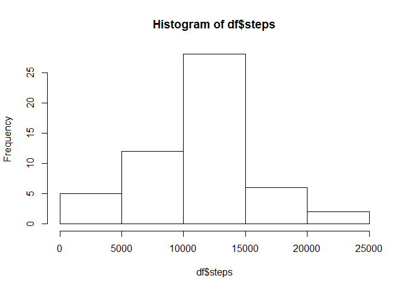
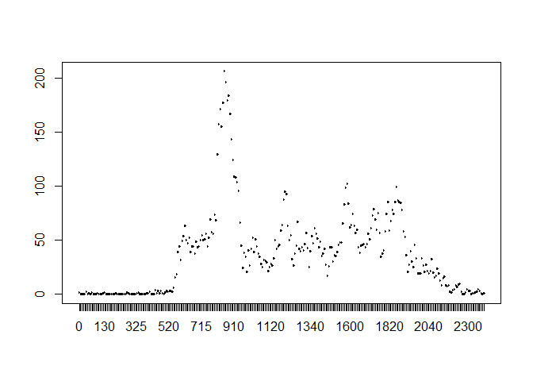
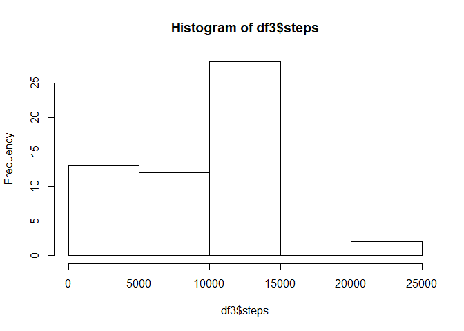
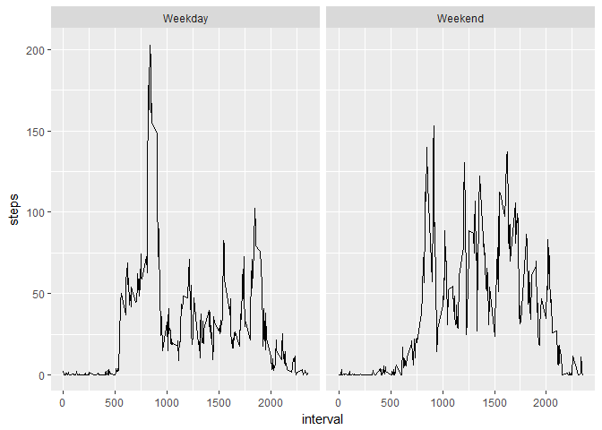

# Reproducible Research: Peer Assessment 1
## Set the global option echo to true, so that the code is always visible.

```r
library(knitr)
opts_chunk$set (echo = TRUE, results = TRUE)
```

## Download the data into the workspace in case it's not already there.

```r
download.file('https://d396qusza40orc.cloudfront.net/repdata%2Fdata%2Factivity.zip', 'activity.zip')
```

## Loading and preprocessing the data

```r
unzip('activity.zip')
data <- read.csv2('activity.csv', sep = ',')
```

## What is mean total number of steps taken per day?
### First subset out all the observations with NA steps.

```r
data2 <- na.omit(data)
```

### Secondly calculate the total steps for each day.

```r
library(dplyr)
```

```
## Warning: package 'dplyr' was built under R version 3.3.3
```

```
## 
## Attaching package: 'dplyr'
```

```
## The following objects are masked from 'package:stats':
## 
##     filter, lag
```

```
## The following objects are masked from 'package:base':
## 
##     intersect, setdiff, setequal, union
```

```r
df <- data2 %>% group_by(date) %>% summarise_each(funs(sum), steps)
df_total_steps <- sum(df$steps)
```

### Thirdly, make a historgram of the total number of steps per day.

```r
hist(df$steps)
```

<!-- -->

### Finally, calculate the mean and median of the total num of steps taking per day.


```r
df_mean <- mean(df$steps)

df_median <- median(df$steps)

df_mean
```

```
## [1] 10766.19
```

```r
df_median
```

```
## [1] 10765
```
The mean total number of steps taken per day is 1.0766189\times 10^{4} and the median of the total number of steps taken per day is 10765.

## What is the average daily activity pattern?
### First change the intervals into factors.

```r
data3 <- data2
data3$interval <- as.factor(data3$interval)
```

### Secondly, find the average number of steps taken, averaged across all days.

```r
df2 <- data3 %>% group_by(interval) %>% summarise_each(funs(mean), steps)
```

### Finally, plot the resulting data.

```r
plot(df2$interval, df2$steps, type = '1')
```

<!-- -->
### Find the 5 minute interval with the maximum number of steps.

```r
max_interval <- df2[which.max(df2$steps),1]
```
The 835 5-minute interval, on average, contains the maximum number of steps.

## Imputing missing values

```r
summary(data)
```

```
##      steps                date          interval     
##  Min.   :  0.00   2012-10-01:  288   Min.   :   0.0  
##  1st Qu.:  0.00   2012-10-02:  288   1st Qu.: 588.8  
##  Median :  0.00   2012-10-03:  288   Median :1177.5  
##  Mean   : 37.38   2012-10-04:  288   Mean   :1177.5  
##  3rd Qu.: 12.00   2012-10-05:  288   3rd Qu.:1766.2  
##  Max.   :806.00   2012-10-06:  288   Max.   :2355.0  
##  NA's   :2304     (Other)   :15840
```

The total number of missing values in the dataset is 2304.

The startegy we will use to fill in the missing values is to use the mean for that specific day.
We will use the Hmisc package's impute function.


```r
library(Hmisc)
```

```
## Warning: package 'Hmisc' was built under R version 3.3.3
```

```
## Loading required package: lattice
```

```
## Loading required package: survival
```

```
## Warning: package 'survival' was built under R version 3.3.3
```

```
## Loading required package: Formula
```

```
## Loading required package: ggplot2
```

```
## Warning: package 'ggplot2' was built under R version 3.3.3
```

```
## 
## Attaching package: 'Hmisc'
```

```
## The following objects are masked from 'package:dplyr':
## 
##     combine, src, summarize
```

```
## The following objects are masked from 'package:base':
## 
##     format.pval, round.POSIXt, trunc.POSIXt, units
```

```r
data4 <- data
data4$steps <- impute(data4$steps)
df3 <- data4 %>% group_by(date) %>% summarise_each(funs(sum), steps)
hist(df3$steps)
```

<!-- -->

```r
df3_mean <- mean(df3$steps)

df3_median <- median(df3$steps)

df3_mean
```

```
## [1] 9354.23
```

```r
df3_median
```

```
## [1] 10395
```
The adjusted mean total number of steps taken per day is 9354.2295082 and the adjusted median of the total number of steps taken per day is 1.0395\times 10^{4}.  The previous calculations were 1.0766189\times 10^{4} and 10765.


```r
df3_total_steps <- sum(df3$steps)
```

The adjusted total number of steps is 5.70608\times 10^{5} while the previous number was 570608.


## Are there differences in activity patterns between weekdays and weekends?
### Convert the dates into weekday factors.
Note that I am only considering Saturday and Sunday as weekends. THe rest are weekdays.

```r
data5 <- data4
weekdays <- c('Monday', 'Tuesday', 'Wednesday', 'Thursday', 'Friday')
data5$date = as.factor(ifelse(is.element(weekdays(as.Date(data5$date)),weekdays), "Weekday", "Weekend"))
```

Calculate the average of each interval over all weekdays and weekends.


###

```r
library(ggplot2)
df_final <- data5 %>% group_by(interval, date) %>% summarise_each(funs(mean), steps)
ggplot(df_final, aes(interval, steps)) + geom_line() + facet_grid(~ date)
```

<!-- -->
